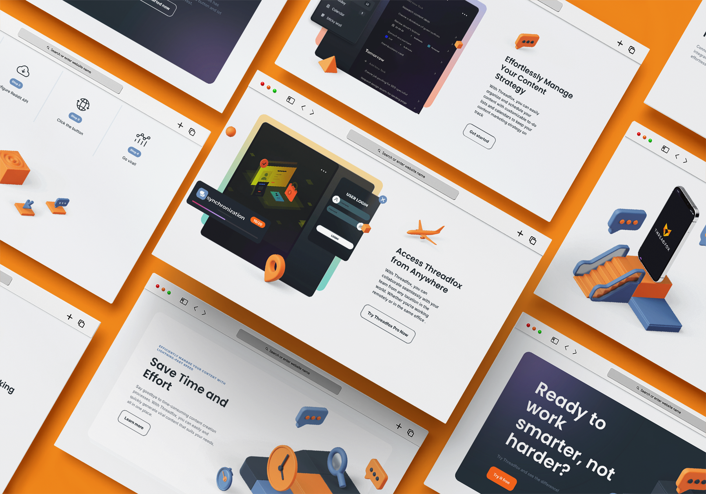
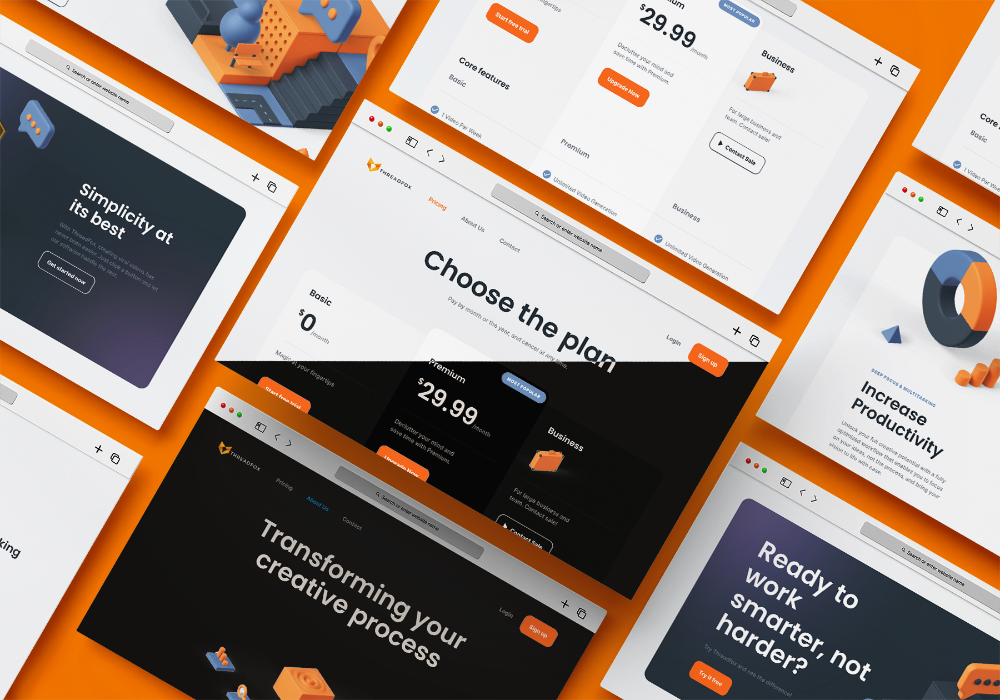

    

# Welcome to Threadfox - Automated Video Content Creation SaaS

## Disclaimer

**Please Note:** The code for this software is strictly classified, as it is currently in the process of being prepared for production and release. This landing page is intended for demonstration purposes only. Any unauthorized use, distribution, or replication of this code is strictly prohibited.

## Preview

  
Click to expand for more images

  
  
  
 

## Live Demo

🌐 Explore the live demo of THREADFOX's landing page: [**Live Demo**](https://sami-souissi.github.io/Threadfox---Automated-Video-Content-Creation-SaaS-Landing-Page-/) 

**Check out Threadfox's Dashboard:** [**Go to Dashboard**](https://github.com/Sami-Souissi/Threadfox---AI-Video-Content-Creation-SaaS)

## Elevate Your Video Content Creation

Threadfox is a cutting-edge web-based Software-as-a-Service (SaaS) application designed to simplify and automate video content creation. This innovative platform leverages the power of the Reddit API and state-of-the-art text-to-speech (TTS) technology to transform Reddit text into captivating videos. Content creators, media managers, marketing firms, and freelancers can harness Threadfox to streamline their video production process.

## Key Features

- **Reddit API Integration:** Effortlessly pull text from any subreddit and thread of your choice using the Reddit API.

- **Text-to-Speech Conversion:** Choose from various TTS engines like Google Translate, pyttsx3, and TikTok TTS for converting text into high-quality audio.

- **Video Download and Editing:** Download videos from YouTube, trim them to your desired length, overlay them with TTS audio, and add watermarks.

- **Trending Subreddit:** Stay up-to-date with real-time trending subreddits.

- **Scheduling Functionality:** Plan and schedule your video uploads in advance.

- **Customizable Settings:** Fine-tune settings like TTS engine, video length, and watermark position to match your requirements.

## Technical Stack

Threadfox is built on a solid foundation of modern technologies:

Our backend relies on Python libraries such as boto3, gTTS, moviepy, praw, pytube, and more, ensuring the highest level of performance and reliability.

## Experience the Future of Video Content Creation

Threadfox allows you to bridge the gap between automation and creativity. Elevate your content strategy and create captivating videos effortlessly. Get ready to redefine your video production workflow.

## License

Threadfox is licensed under the [MIT License](LICENSE). Feel free to use and modify this software within the terms of the license.

